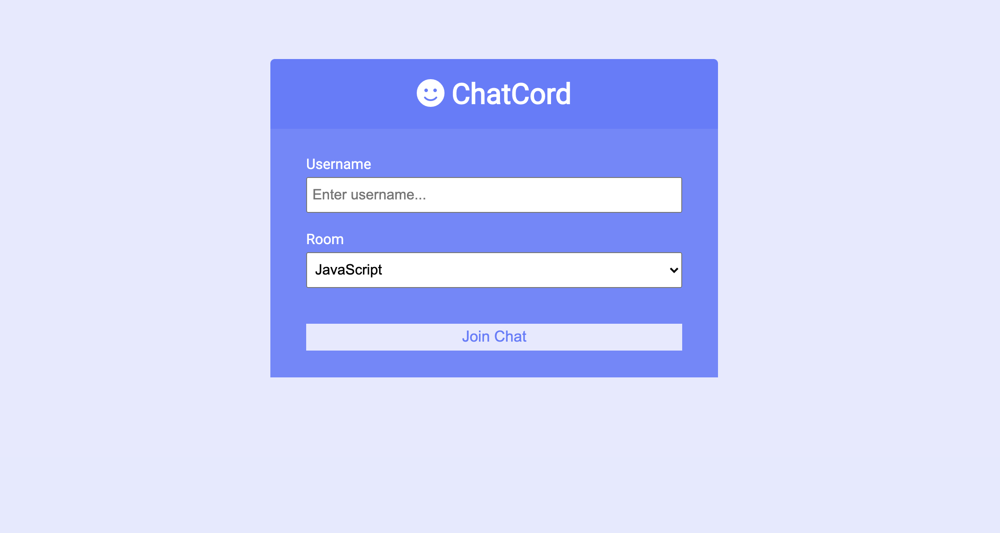
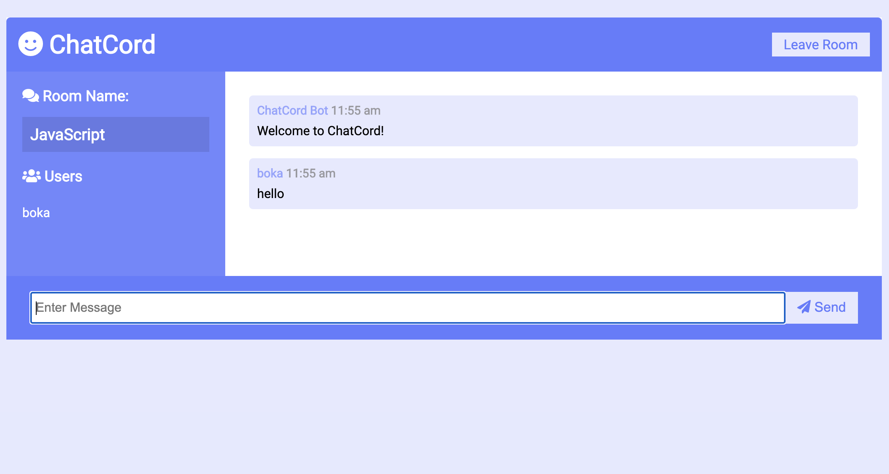

# Chat Application

- [Javascript -  Realtime Chat Application](#Javascript)
- [React - Realtime Chat Application](#React)

---

## Javascript

- 영상 : [Realtime Chat With Users & Rooms - Socket.io, Node & Express](https://www.youtube.com/watch?v=jD7FnbI76Hg&list=LLtcfhvAdHVLoVcmlgDyKEnA&index=11)

- node 셋팅

```
1. npm init
2. npm install express socket.io moment
3. npm install -D nodemon
```

<br>

- 추가한 사항
    - docker 사용
    - mongo DB 연동

<br>

- docker 셋팅

```
docker pull mongo:latest
docker-compose up

// node로 확인
node db.js
```

<br>

- 완성화면

<div align="center"></img></div>

<div align="center"></img></div>


---

## React