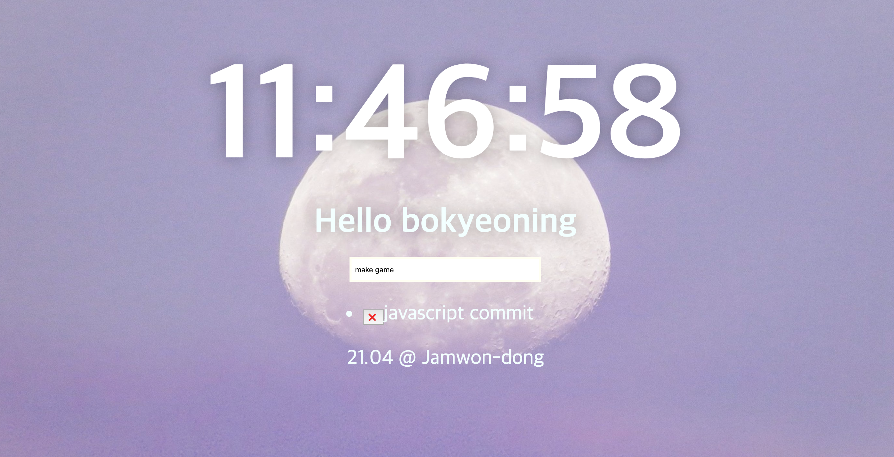
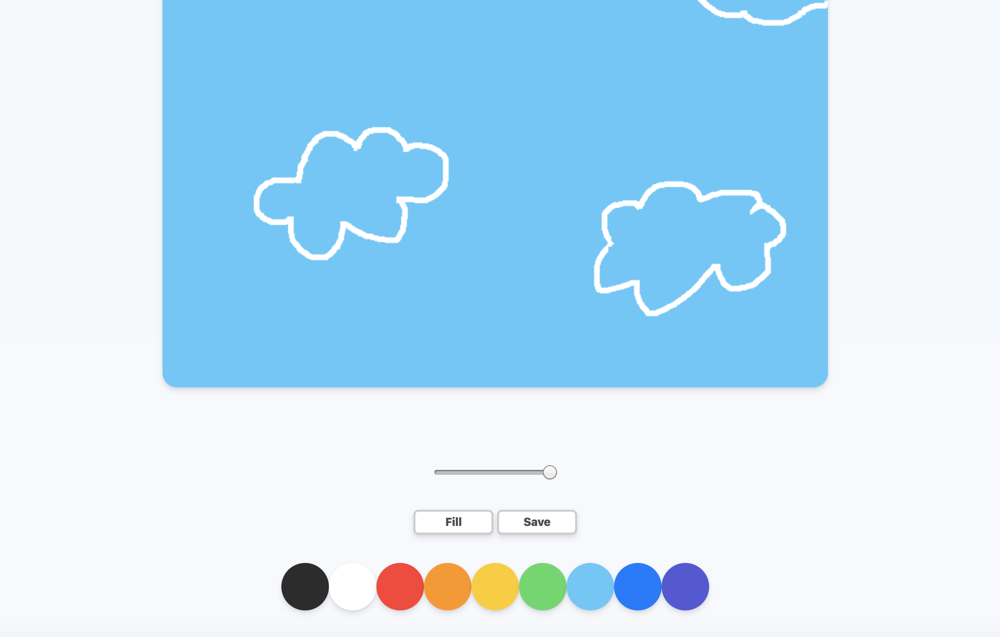
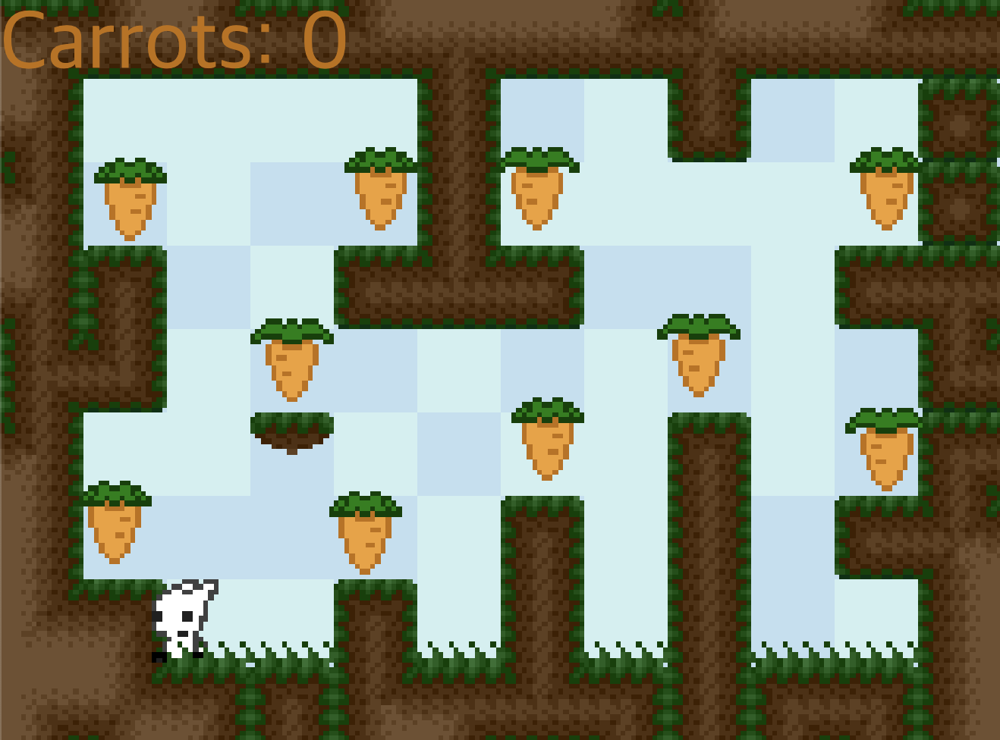
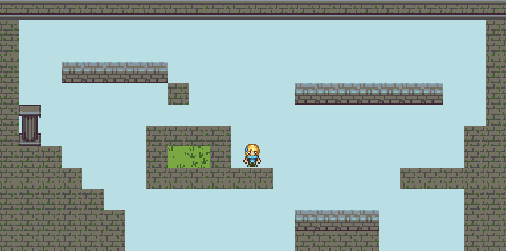

# JavaScript

### JavaScript 정의
- 객체 기반의 스크립트 프로그래밍 언어
- 웹 브라우저 내에서 주로 사용
- HTML로는 웹의 내용을 작성하고, CSS로는 웹을 디자인하며, 자바스크립트로는 웹의 동작을 구현
- 다른 응용 프로그램의 내장 객체에도 접근할 수 있는 기능을 가지고 있음
- Node.js와 같은 런타임 환경과 같이 서버 사이드 네트워크 프로그래밍에도 사용되고 있음

 

### JavaScript 특징
- 객체 기반의 스크립트 언어
- 동적이며, 타입을 명시할 필요가 없는 인터프리터 언어
- 객체지향형 프로그래밍과 함수형 프로그래밍 모두 표현 가능

----------------------

### Momentum 
- 최종 결과물
[자세한 내용은 Momentum README.md 참고](https://github.com/BoKyeong-Kim/JavaScript/tree/master/Momentum)

</img>

-----------------------

### paintBoard : painting board
- 최종 결과물
[자세한 내용은 paintBoard README.md 참고](https://github.com/BoKyeong-Kim/JavaScript/tree/master/paintBoard)

</img>

-----------------------

### game
- 최종 결과물
[자세한 내용은 game README.md 참고](https://github.com/BoKyeong-Kim/JavaScript/tree/master/game)

</img>

-----------------------

### bokaMap
- 최종 결과물

</img>

----------------------

### Chat Application

- 최종 결과물
[자세한 내용은 Chat README.md 참고](https://github.com/BoKyeong-Kim/JavaScript/tree/master/Chat)

</img>

