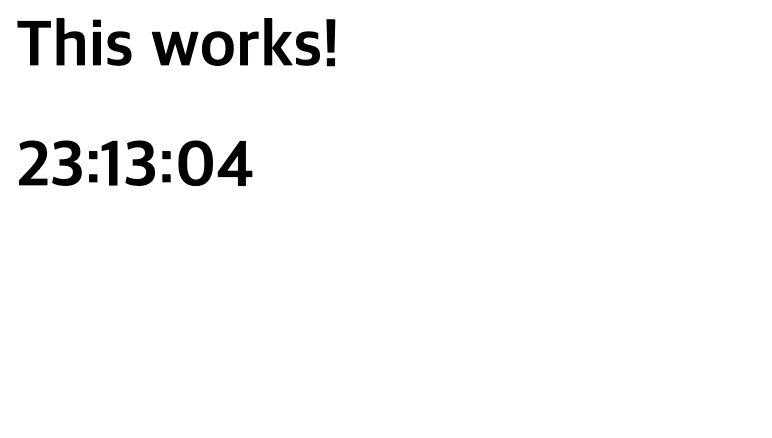
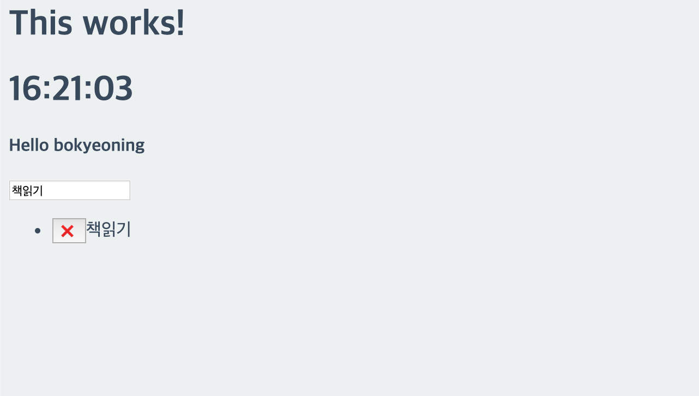
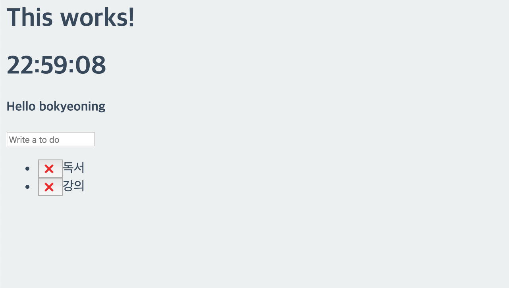
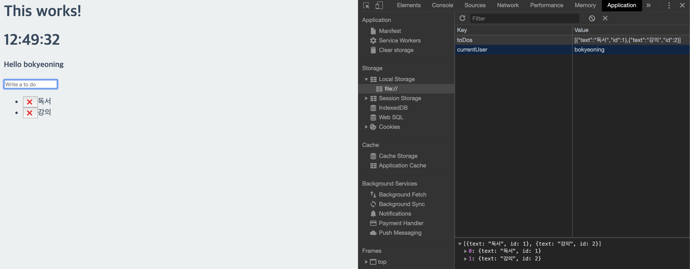
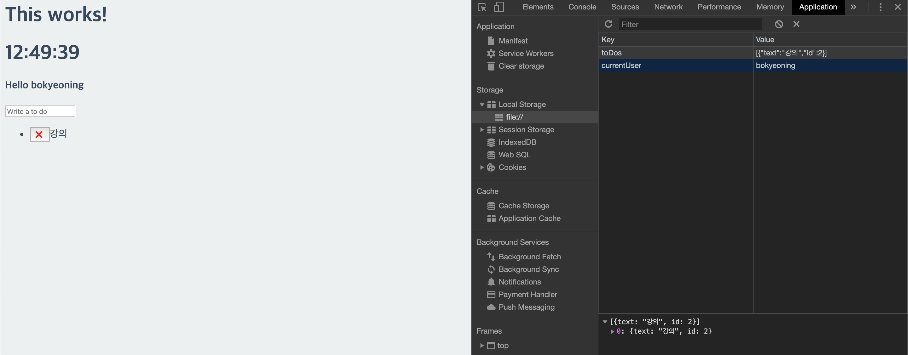
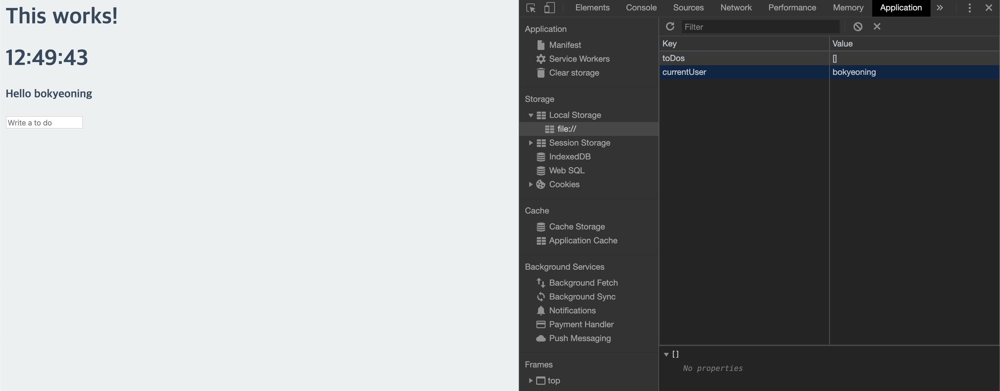

# JavaScript

### JavaScript 정의
- 객체 기반의 스크립트 프로그래밍 언어
- 웹 브라우저 내에서 주로 사용
- HTML로는 웹의 내용을 작성하고, CSS로는 웹을 디자인하며, 자바스크립트로는 웹의 동작을 구현
- 다른 응용 프로그램의 내장 객체에도 접근할 수 있는 기능을 가지고 있음
- Node.js와 같은 런타임 환경과 같이 서버 사이드 네트워크 프로그래밍에도 사용되고 있음

<br>

### JavaScript 특징
- 객체 기반의 스크립트 언어
- 동적이며, 타입을 명시할 필요가 없는 인터프리터 언어
- 객체지향형 프로그래밍과 함수형 프로그래밍 모두 표현 가능

<br>

### 바닐라 JS로 크롬 앱 만들기
- [노마드코더님의 바닐라 자바스크립트 강의](https://academy.nomadcoders.co/courses/)를 통해 제작

<br>

#### COMMIT : Making a JS Clock part One
</img>
- 첫번째 커밋을 했을 때, 시간은 고정된 상태로 화면에 나타나게 된다.
- 그리고 예를들어 11시 30분 05초라고 한다면 11:30:05가 아닌 11:30:5로 나오게 된다.
- 이 부분을 수정하는 코드를 작성

<br>

#### COMMIT : Making a JS Clock part Two
</img>
- 위 사진처럼 4초가 아닌 04초로 나오게 수정

<br>

#### COMMIT : Saving the User Name part One
</img>

- `local storage(로컬 스토리지)` : 사용자 로컬에 저장하는 임시 저장소
    - 세션유지와 상관없이 데이터 유지되게 함(브라우저상에서 정보를 간단히 저장해서 사용해야할 떄 유용하게 사용가능)
- `localStorage.setItem(key, value)` 메서드에 key, value값을 주면 데이터가 저장된다.
    - key는 저장된 값을 식별하고 가져오는 데 사용되고 원하는 만큼 로컬 스토리지에 key를 저장할 수 있다. 
    - 반대로 key를 가져올 때는 조회하려는 key 값으로 요청 
    - 할당된 key에 저장되는 값은 숫자, 문자열 또는 객체(JSON)나 array(배열) 같은 형태로 저장할 수 있다.
- `localStorage.getItem(key)` 메서드는 해당 key 값의 이름을 가진 데이터를 가져온다.

<br>

#### COMMIT : Saving the User Name part Two
</img>

<br>

#### COMMIT : Making a To Do List part One
</img>

<br>

#### COMMIT : Making a To Do List part Two
</img>
- local storage에는 자바스크립트의 data를 저장할 수 없음.
- string으로만 저장하여 JSON.stringify를 사용하여 object를 string으로 바꿔줌
- `forEach()` : array에 담겨있는 것들 각각에 한 번씩 함수 실행

<br>

#### COMMIT : Making a To Do List part Three
</img>
- 기존에 추가해놓은 일정들을 확인할 수 있다.

</img>
- 첫번째 일정에 대한 delete 버튼을 누르면 일정이 삭제된다.

</img>
- 두번째 일정에 대한 delete 버튼을 누르면 일정이 삭제된다.

<br>

##### var, let, const 차이점
- const, let은 ES6(ECMAScript6)의 문법
- var는 ES6이전 문법
- `var` : 변수 선언 방식에서 변수를 한번 더 선언하면 다른 값이 나온다.
```JavaScript
    var name = 'bokyeong' 
    console.log(name) //bokyeong
    var name = 'bokyeoning' 
    console.log(name) //bokyeoning
```

- `let` : 변수 재선언 불가능, 재할당 가능
```JavaScript
    let name = 'bokyeong' 
    console.log(name) //bokyeong
    let name = 'bokyeoning' 
    console.log(name) //error
    name = 'bokyeoning'
    console.log(name) //bokyeoning
```

- `const` : 변수 재선언, 재할당 모두 불가능
```JavaScript
    const name = 'bokyeong' 
    console.log(name) //bokyeong
    const name = 'bokyeoning' 
    console.log(name) //error
    name = 'bokyeoning'
    console.log(name) //error
```


<br>

`querySelector()`
- 특정 name 이나 id 를 제한하지않고 css선택자를 사용하여 요소를 찾음(수정하거나 접근해서 정보를 가져올수 있음)
- querySelector()는 타겟의 자식요소 한가지만 가져옴
- querySelectorAll()은 타겟의 자식요소를 모두 가져옴


<br>

`addEventListener()`
- 이벤트리스너를 추가하는 자바스크립트 메소드
- 지정한 이벤트가 대상에 전달될 때마다 호출할 함수를 설정
- 여러개의 이벤트 핸들러 등록가능

<br>

#### 타이머 함수

`setInterval(function, duration)`
- 일정한 시간을 두고 작업을 수행하기위해서 사용
-  clearInterval(timerid) 함수를 사용하여 중지할 수 있음
    - 특정 타이머 id를 가진 타이머함수를 종료
`setTimeOut(function, duration)`
- 특정시간 이후에 딱 한번만 특정함수를 호출하여 실행

