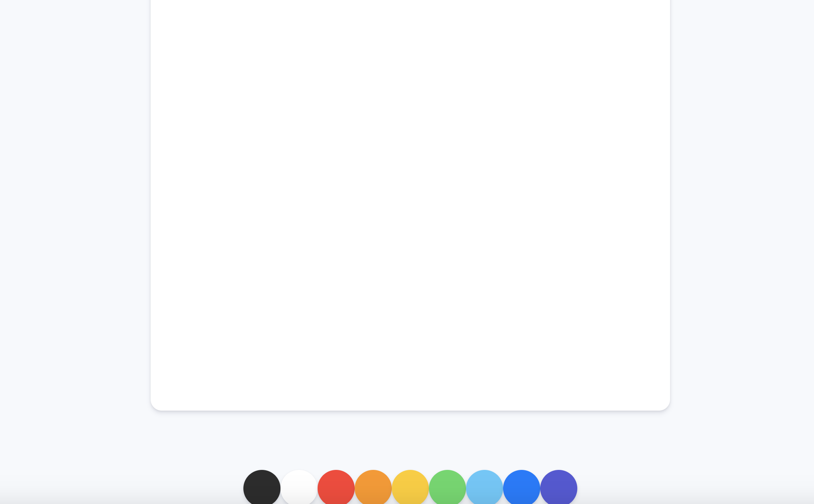
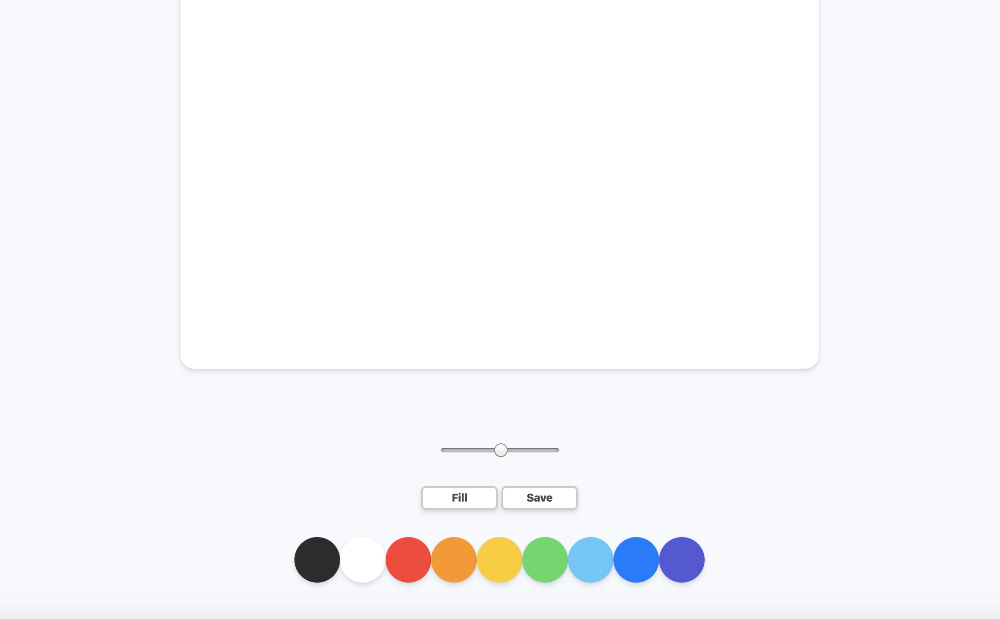
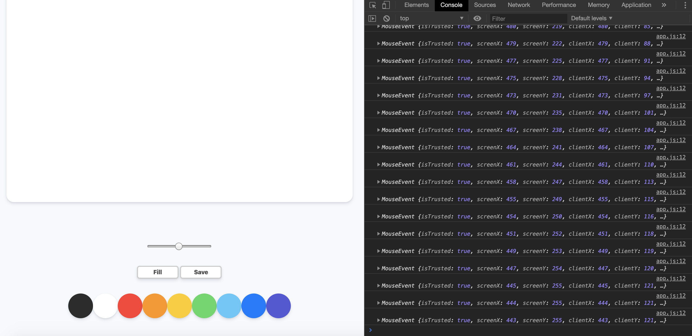
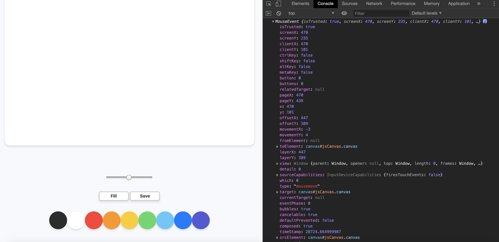

### PaintBoard

#### COMMIT : 1)project setup

- 환경셋팅 해주기

 

#### COMMIT : 2)Styles part One

</img>

 

#### COMMIT : 3)Styles part Two

</img>

 

#### COMMIT : 4)Canvas Events

- offset x와 y에 대해서 가져온다.
- canvas event에 대해 log를 찍어보면 가져오고자 하는 부분을 확인할 수 있다.

</img>

</img>

 

