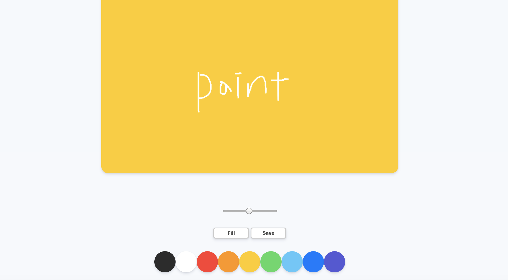
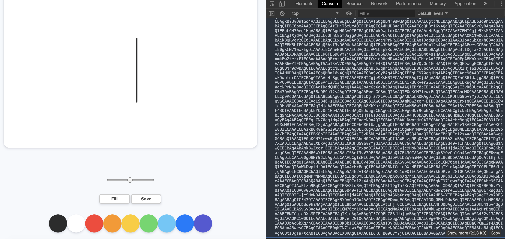

### PaintBoard

#### COMMIT : 1)project setup

- 환경셋팅 해주기

<br>

#### COMMIT : 2)Styles part One

</img>

<br>

#### COMMIT : 3)Styles part Two

</img>

<br>

#### COMMIT : 4)Canvas Events

- offset x와 y에 대해서 가져온다.
- canvas event에 대해 log를 찍어보면 가져오고자 하는 부분을 확인할 수 있다.

</img>

</img>

<br>

#### COMMIT : 5) 2D context

- 기본적으로 Canvas는 HTML의 한 요소인데, 다른점은 `context`를 갖는다는 점이다.
- `context`란 canvas란 요소안에서 픽셀에 접근할 수 있는 방법을 말한다.

<br>

#### COMMIT : 6)Draw lines on the painting board

- `moveTo` 함수는 path를 나타내고,`lineTo` 함수는 선을 그리는 x,y 를 나타낸다.
- 현재 console.log를 찍어보면 마우스를 클릭하여 움직일때(선을 그릴때)와, 클릭하지 않은 상태에서 마우스를 움직일 때가 다르게 나타난다.

</img>

<br>

#### COMMIT : 7)Changing Color

- event에 대해 console.log를 출력해서 가져와야하는 부분을 확인한다.
- 가져온 event에 대해 target >> style >> backgroundColor 부분을 가져온 후, color에 대입.
- backgroundColor부분에 rgb가 있기때문.

</img>

- 그 부분을 가져와서 기본값으로 설정해두었던 strokeStyle에 color를 대입해준다.
- 그럼 아래와 같이 색을 변경하여 사용 가능

</img>

<br>

#### COMMIT : 8)Brush Size

- Brush 기본 사이즈 (2.5)

</img>

- Brush min 사이즈 (0.1)

</img>

- Brush max 사이즈 (5)

</img>

<br>

- 전체의 board를 선택한 색상으로 채우기 위해 만들어두었던 fill 버튼을 누르면 paint버튼이 나오도록 코드를 작성.

</img>

<br>

#### COMMIT : 9)Filling Mode
- filling일때 색상을 정해 board를 클릭하면 정한 색상 전체를 적용시키는 코드를 작성
- fillRect(x, y, w, h) 함수 사용 

</img>


- paint를 선택하고 클릭을하면 선으로 그림을 그릴 수 있게된다.

</img>

<br>

#### COMMIT : 10)Saving the Image
```javascript
const image = canvas.toDataURL("image/png");
console.log(image);
```
위의 코드를 작성하면 image의 링크가 나온다.

</img>

<br>

- 위에서 출력된 링크를 복사하여 붙여넣으면 아래처럼 이미지가 나타난다. 

</img>

<br>

- href는 이미지가 되어야하고, download는 그 이름을 가져야한다.
- 설정을 해주고나면 아래와 같이  href와 download가 적힌 링크를 볼 수 있다.(console.log(link))

</img>


- save 클릭 

</img>

- 이미지파일이 저장된 것을 확인할 수 있다.

</img>


